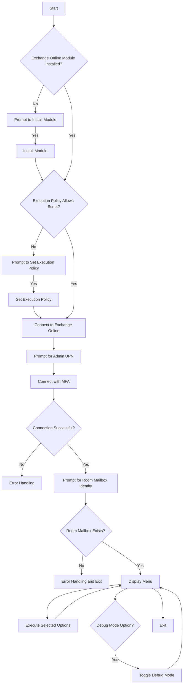

# PowerShell Script Plan: Exchange Online Room Mailbox Configuration

This document outlines the plan for a PowerShell script to automate the configuration of Exchange Online room mailboxes.

## Features

*   **Interactive Menu:** A menu-driven interface guides the user through configuration steps.
*   **Exchange Online Integration:** Connects to Exchange Online using administrator credentials (with MFA support).
*   **Room Mailbox Configuration:** Automates the following settings:
    *   Set `AddOrganizerToSubject` and `DeleteSubject` to `$false`.
    *   Grant "Editor" access to a coordinator group.
    *   Set default user access rights to "Reviewer".
    *   Grant "Reviewer" access to a digital signage group.
    *   Add resource delegates.
    *   Remove existing permissions.
    *   Show current permissions.
    *   Show current calendar settings.
*   **Input Validation:** Verifies the existence of the room mailbox.
*   **Error Handling:** Uses `try-catch` blocks and checks for non-terminating errors.
*   **Debug Mode:** Provides verbose output for troubleshooting.
*   **Module Installation:** Checks for and installs the `ExchangeOnlineManagement` module if needed.
*   **Execution Policy Handling:**  Checks and sets the execution policy to `RemoteSigned` if necessary.

## Script Structure

1.  **Module Installation and Execution Policy:**
    *   Check for `ExchangeOnlineManagement` module.
    *   Prompt to install if missing.
    *   Check and set execution policy to `RemoteSigned` if needed.

2.  **Connect to Exchange Online:**
    *   Prompt for admin UPN.
    *   Use `Connect-ExchangeOnline` with MFA support.

3.  **Get Room Mailbox Identity:**
    *   Prompt for room mailbox email address.
    *   Validate mailbox existence using `Get-Mailbox`.

4.  **Main Menu Loop:**
    *   Display menu options:
        1.  Set Calendar Processing Settings
        2.  Grant Editor Access to Coordinator Group
        3.  Set Default User Access Rights to Reviewer
        4.  Grant Reviewer Access to Digital Signage Group
        5.  Add Resource Delegates
        6.  Remove Existing Permissions for a User
        7.  Show Current Permissions
        8.  Show Calendar Settings
        9.  Enable/Disable Debug Mode
        10. Exit
    *   Execute selected option.
    *   Repeat until the user chooses to exit.

5.  **Menu Option Functions:**
    *   Each menu option is implemented as a separate function.
    *   Functions use `Write-Host` for user interaction, `try-catch` for error handling, and `Write-Verbose` for debug output.

## Mermaid Diagram



## PowerShell Code Structure (Conceptual)

```powershell
# --- Script Start ---

# --- Global Variables ---
\$DebugPreference = "SilentlyContinue"  # Debug mode off by default

# --- Module Installation and Execution Policy ---
# (Implementation as described above)

# --- Connect to Exchange Online ---
# (Implementation as described above)

# --- Get Room Mailbox Identity and Validate ---
# (Implementation as described above)

# --- Function: Show-Menu ---
function Show-Menu {
    # (Implementation to display the menu and get user choice)
}

# --- Function: Set-CalendarProcessingSettings ---
function Set-CalendarProcessingSettings {
    # (Implementation as described above, with Write-Verbose)
}

# --- (Functions for other menu options) ---
# ...

# --- Function: Toggle-DebugMode ---
function Toggle-DebugMode {
    # (Implementation to toggle \$DebugPreference)
}

# --- Main Menu Loop ---
do {
    \$choice = Show-Menu
    switch (\$choice) {
        1 { Set-CalendarProcessingSettings }
        # ... (Other menu options)
        9 { Toggle-DebugMode }
    }
} until (\$choice -eq 10)

# --- Script End ---